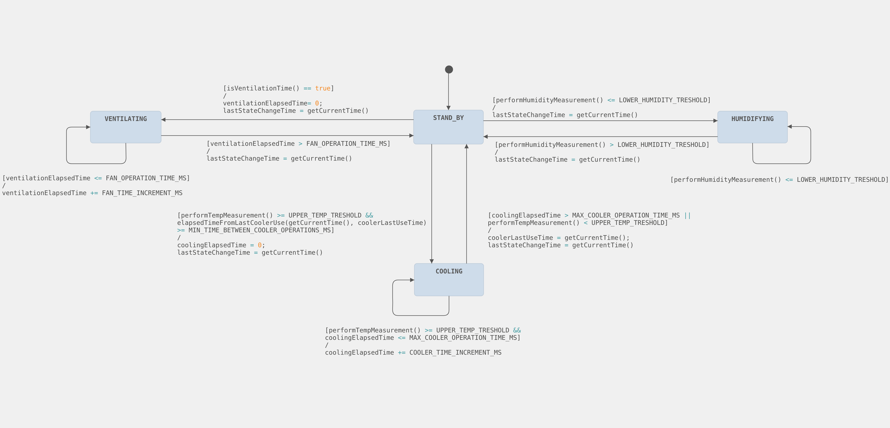

# Sistema de control de fructificación de hongos

&emsp;&#x1F4DD;&emsp;**Segunda entrega**

&emsp;&#x1F5D3;&emsp;**Sábado 03 de mayo de 2025**

&emsp;&#x1F464;&emsp;**Gabriel Sosa (87311)**

---

## Objetivo

&emsp;Diseñar e implementar un sistema embebido que permita controlar automáticamente las condiciones de temperatura, humedad y ventilación en una cámara de fructificación de hongos, registrando eventos relevantes y permitiendo interacción con el/la usuario/a a través de un menú en pantalla y teclado matricial.

---

## Descripción

### Funcionamiento

> :video_camera: **Video de funcionamiento**: [Sistema de control de fructificación de hongos](https://drive.google.com/file/d/1nMh9fucZgdIqfXqENMr_M2UNnSrEXTLN/view?usp=drivesdk)

&emsp;El sistema funciona de forma autónoma y ligada a una **máquina de estados finitos (FSM)** que evalúa periódicamente los sensores conectados. Además, el/la usuario/a puede configurar umbrales de temperatura y humedad, visualizar el estado actual, consultar registros y configurar el reloj interno (RTC) desde un menú interactivo.

---

## Variables controladas

| Variable     | Sensor                     | Actuador                     |
|--------------|----------------------------|------------------------------|
| Temperatura  | Sensor digital DHT22       | Módulo Peltier con cooler    |
| Humedad      | Sensor digital DHT22       | Humidificador ultrasónico    |
| Ventilación  | RTC + temporizador interno | Cooler 12 V + compuerta (servo) |


---

## Estructura general

### Directorios

| Directorio/Archivo        | Contenido principal                                          |
|-------------------|--------------------------------------------------------------|
| `TP2-SE-87311/`            | Archivos fuente del proyecto (organizados por módulo)        |
| `TP2-SE-87311/modules/fsm/`        | Lógica de la máquina de estados                              |
| `TP2-SE-87311/modules/menu/`       | Menú de usuario (TFT + keypad)                               |
| `TP2-SE-87311/modules/display/`    | Funciones gráficas para el display ILI9341                   |
| `TP2-SE-87311/modules/events/`     | Registro de eventos con timestamp                            |
| `TP2-SE-87311/modules/sensors/`    | Interfaces con el DHT22                                      |
| `TP2-SE-87311/modules/actuators/`  | Control de humidificador, cooler, ventilador y servos        |
| `main.cpp`        | Lazo principal y configuración del sistema                   |

---

## Implementación

### Máquina de Estados (FSM)

El sistema implementa una **FSM** que evalúa las condiciones cada 2 s y actúa según los siguientes criterios:

| Estado         | Condición de entrada                                   | Duración    | Acción asociada             |
|----------------|--------------------------------------------------------|-------------|-----------------------------|
| STAND_BY       | Estado base                                            | -           | Todo apagado                |
| HUMIDIFYING    | Humedad menor al umbral configurado                    | 10 s        | Humidificador encendido     |
| COOLING        | Temperatura mayor al umbral configurado               | 10 s        | Peltier/cooler encendido    |
| VENTILATING    | Cada 60 s (cronómetro interno del FSM)                 | 5 s         | Ventilador encendido        |

&emsp;La duración de cada estado es fija, y se retorna automáticamente a `STAND_BY` tras cumplido el tiempo.

&emsp;El siguiente diagrama fue confeccionado con el software en la nube <a href="https://www.itemis.com/en/products/itemis-create/">**Itemis Create**</a>:


---

> **NOTA**: varias de las variables que pueden visualizarse en este no compareten el mismo nombre que en el código fuente.

### Interfaz

&emsp;La interacción con el sistema se realiza a través de:

| **Display gráfico TFT ILI9341** | Permite al usuario visualizar las opciones del sistema. |
| **Teclado matricial 4x4** | Permite al usuario interactuar con la interfaz gráfica. |
| **Salida UART** | Permite a los desarrolladores depurar el sistema. |

#### Menú principal:

```
--- MUSHROOMER MENU ---
1: SHOW FSM STATE
2: SHOW TEMP & HUM
3: SAVE STATE TO LOG
4: VIEW EVENT LOG
5: SET RTC TIME
6: SHOW CURRENT TIME
A: SET TEMP UPPER THRESHOLD
B: SET HUM LOWER THRESHOLD
#: RETURN TO MAIN MENU
```


---

### Registro de eventos

&emsp;Cada vez que el/la usuario/a elige la opción 3, se guarda un evento con:

- Estado actual del sistema (FSM)
- Temperatura y humedad al momento
- Timestamp (RTC)

&emsp;Se permite visualizar los últimos eventos desde el menú (opción 4). Se muestran hasta cinco registros en pantalla.

---

### Umbrales configurables

&emsp;Desde el menú se puede modificar:

- **Umbral superior de temperatura (opción A)**: el usuario ingresa dos dígitos que representan la temperatura deseada en °C, redondeada a entero.
- **Umbral inferior de humedad (opción B)**: ingreso similar en %HR, también como entero.

&emsp;Los nuevos valores se aplican de forma inmediata y afectan el comportamiento de la FSM.

&emsp;Para facilitar el diagnóstico visual durante el desarrollo, se utilizaron los LEDs integrados en la placa NUCLEO-F429ZI como indicadores del estado de los actuadores:

| LED  | Representa                   | Encendido indica que…                  |
| ---- | ---------------------------- | -------------------------------------- |
| LED1 | **Sistema de refrigeración** | El módulo Peltier (cooler) está activo |
| LED2 | **Humidificador**            | El humidificador está encendido        |
| LED3 | **Ventilación**              | El ventilador está funcionando         |


---

## Periféricos utilizados

| Componente         | Función                                           | Conexión                         |
|--------------------|--------------------------------------------------|----------------------------------|
| Display ILI9341    | Interfaz gráfica (menú + datos)                  | SPI (CS, DC, RST, MOSI, SCK)     |
| Teclado 4x4        | Entrada de comandos del usuario                   | 8 pines GPIO (4 filas, 4 columnas) |
| Sensor DHT22       | Medición de temperatura y humedad                 | GPIO digital                     |


---

## Próximos pasos 

&emsp;La simplicidad del sistema abre un abanico de posibilidades para futuras mejoras. Algunas ideas incluyen:

- Integración de más sensores (CO₂, luz, etc.)
- Registro en tajeta SD
- Visualización de datos en tiempo real y gráficos
- Control remoto por Wi-Fi


